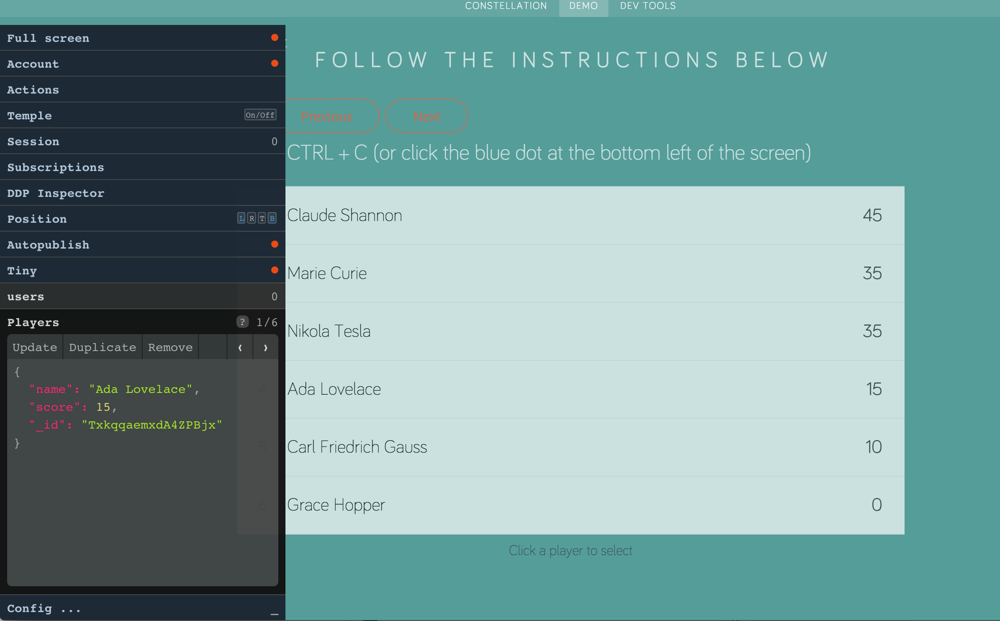

Constellation
=============

__Constellation__ is an extensible, configurable, free, open-source dev console for Meteor.



It provides an API for adding plugins (custom tabs) to the existing UI.

[Constellation Demo Site](http://constellation.taonova.com/demo)

Usage
-----
```
meteor add constellation:console
```

After installation, press <strong>Control + C</strong> to toggle it.

Plugins
-------

Examples of plugins are:

- [babrahams:temple](https://github.com/JackAdams/temple) (for visualizing template information)
- [lai:ddp-inspector](https://github.com/rclai/meteor-ddp-inspector) (visualize the DDP traffic between client and server)
- [yelongren:constellation-reload](https://github.com/yelongren/constellation-reload) (reload app while preserving Session variables)
- [alon:lag-console](https://atmospherejs.com/alon/lag-console) (add a lag to methods to simulate real-world response times)
- [fermuch:stats.js](https://atmospherejs.com/fermuch/stats.js) (JS performance monitoring with stats.js)
- [fourquet:anti-gravity](https://atmospherejs.com/fourquet/anti-gravity) (for detecting out-of-date packages)
- [constellation:session](https://github.com/JackAdams/constellation-session) (for viewing / manipulating data in the Session variable)
- [constellation:subscriptions](https://github.com/JackAdams/constellation-subscriptions) (for viewing current subscriptions)
- [constellation:autopublish](https://github.com/JackAdams/constellation-autopublish) (for toggling autopublish behaviour)
- [constellation:tiny](https://github.com/JackAdams/constellation-tiny) (for _really_ minimizing the UI)
- [constellation:connection](https://github.com/JackAdams/constellation-connection) (for monitoring and toggling connection status)
- [constellation:shorten-collection-names](https://github.com/JackAdams/constellation-shorten-collection-names) (when your collection names get too long)
- [constellation:velocity](https://github.com/JackAdams/constellation-velocity) (`velocity:html-reporter` miniaturized for Constellation)
- [constellation:position](https://github.com/JackAdams/constellation-position) (allows you to change the Constellation console position)
- [constellation:schema](https://github.com/JackAdams/constellation-schema) (generate SimpleSchema from the Constellation console)
- [constellation:plugins](https://github.com/JackAdams/constellation-plugins) (self-service menu of Constellation plugins)
- [constellation:dump-restore](https://github.com/JackAdams/constellation-dump-restore) (dump and restore mongo collections)

If you want to write a plugin, take a look at the source of the packages above.

If you'd like to start with a few plugins installed, copy this into the command line:
```
meteor add constellation:console constellation:subscriptions constellation:autopublish constellation:session babrahams:temple
```

OR (for a curated distro of Constellation packages):
```
meteor add babrahams:constellation
```

Making plugins
--------------

Make a package with the following in the `package.js` file:

```
api.use('constellation:console@1.4.4');
api.imply('constellation:console');
```

__Note__: make sure you put `debugOnly: true` in your package's `Package.describe({ ... });`

And then put something like this in a js file on the client:

```
Package["constellation:console"].API.addTab({
  name: 'my-plugin',
  mainContentTemplate: 'Constellation_my-plugin_view',
  headerContentTemplate: 'Constellation_my-plugin_header',
  menuContentTemplate: 'Constellation_my-plugin_menu'
});
```

`name` is the only mandatory field, but if you want your package to have any visual presence in Constellation, you'll want to at least set the `mainContentTemplate` field to the name of a template that contains your plugin UI.

`headerContentTemplate` is rendered in the header bar of the Constellation UI, right before the name of your plugin (we're assuming you'll probably want this to `float: right;`).

`menuContentTemplate` is rendered in the strip at the top of the main content area of the tab that appears when the tab is open.

`subMenuContentTemplate` is rendered just below the menu strip of the tab, but above the main content. This part is fixed, while the main content scrolls. It gives some extra space to work with if you can't fit everything you need in the menu content strip.

`mainContentTemplate` is rendered in the space for the main content when a tab is open.

`guideContentTemplate` is rendered in the `Config | Guide` tab when the guide for your plugin is selected.

You can set `active: false` in the object above if you don't want your plugin to be shown automatically (the user can make it visible through the "Config" tab).

`noOpen: true` means the tab won't open when clicked.

`callback: "myCallBack"` will fire the `"myCallBack"` function every time the tab header is clicked. `"myCallBack"` must be registered as shown in the API section below.

`addBaseClass: "my-custom-class"` will add `my-custom-class` to the container `<div>` of the Constellation widget. [constellation:position](https://github.com/JackAdams/constellation-position) is an example of a plugin that uses this.

`title: "Title when I hover over tab"` will give the tab a title. But use this sparingly -- a descriptive tab name is far better. (Note: the tab name bar also gets the class `Constellation_tab_constellation_plugin_<name>` automatically, so you can target it for styling if you need to.)

You can also set `id: "unique-id-for-my-tab"` if you like, but unless two plugins share the same name, this isn't going to be necessary.

API
---

All methods must be prefixed by `Package["constellation:console"].API.` when using them in your plugin code, so write this at the top of your files that use the API
```
var Constellation = Package["constellation:console"].API;
```
then you can write:

`Constellation.isActive()` to check whether Constellation's UI is active or closed (i.e. has the user pressed __Control + C__ or not)

`Constellation.addTab({name: "my-plugin"})` to register a new tab called "my-plugin" in Constellation's UI - see above for the fields the object can have when adding a tab.

The `type` field/param in the three methods below will be:
 - `"collection"` for collection tabs
 - `"plugin"` for any tab added using `Constellation.addTab` - i.e. for tabs added by plugin packages and for the default tabs ("Fullscreen", "Account", "Actions", "Config")

`Constellation.getCurrentTab()` to get the `id` and type of the currently selected tab in an object of the form `{id: <tabId, type: <tabType>}` (both values are strings)

`Constellation.setCurrentTab("unique-id-of-my-tab", type)` to change tabs programatically (use either the `id` value set in `addTab({ ... })` or the `name` value if no `id` was set)

`Constellation.isCurrentTab("unique-id-of-my-tab", type)` to check whether this is the current tab or not (returns `true` if you've passed the `id` of the current open tab, along with the correct `type`)

`Constellation.tabVisible("unique-id-of-my-tab", type)` to check if this tab is currently enabled by the user via the "Config ..." panel (i.e. does it currently appear as a tab in the user's UI)

`Constellation.isFullScreen()` to see if Constellation is in fullscreen mode

`Constellation.hideCollection('collectionName')` to hide collections programatically (collections hidden this way cannot be unhidden through the "Config" tab - they won't even appear there) - accepts an array or a string

`Constellation.showCollection('collectionName')` to show collections programatically - accepts an array or a string

`Constellation.setKeyCode(keyCode)` to change the default toggle key from CTRL + C to CTRL + [whichever key's keycode you set] (Note: this should only be used in app code, as a last-resort config option, and not in plugin package code). In fact, this can be set using the 'Config | Guide' tab now, so I'd say don't use this at all.

`Constellation.excludeSessionKeysContaining(prefix)` to hide any `Session` keys containing the given string (`prefix`) from the `constellation:session` package

`Constellation.excludedSessionKeys` to get an array of the strings that will be tested against `Session` keys to exclude them from display in the `constellation:session` package

`Constellation.toggleConsole()` toggles the Constellation console (same effect as CTRL + C, but can be called programatically)

`Constellation.addBaseClass(className)` lets you add a class to the Constellation container element programatically

`Constellation.removeBaseClass(className)` lets you remove a class from the Constellation container element programatically

`Constellation.getCollections()` returns a list of the collections visible in the "Config ..." tab (including those hidden by unchecking them), but not the ones hidden using `Constellation.hideCollection('collectionName')`

If you put a `callback` in your `addTab({ ... })` (e.g. `Constellation.addTab({name: "my-plugin", callback: "myCallBack", ...});`) you need to register it as follows:
```
Constellation.registerCallbacks({
  "myCallBack" : function () {
    console.log("Callback fired!");
  }
});
```
